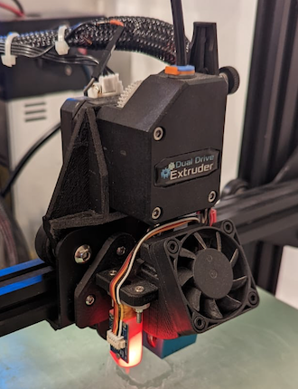

# SpeedDrive documentation 

Update: Moving this project to github. Future updates will be here.

The motivation behind creating the SpeedDrive mount was to extract maximum performance out of my ender3 with mostly stock parts. Print FAST with near-perfect quality. After pushing Bowden to its limit, I came to the conclusion (like many others), that sharp and accurate corners are simply impossible with a Bowden setup. Bowden setups are great for models with curvature, but for my particular uses, I was printing precisely engineered parts that often needed to fit together. Bowden setups produce poor corners because of imprecise linear/pressure advance due to play and friction inside the Bowden tube. This can be reduced to some extent, but never entirely eliminated.

I started playing around with various mount designs and found them to be inadequate. The corners were good, but ringing and vibration prevented high speed printing and good bed adhesion. The orientation of the motor and distance from the X extrusion was not suited for sufficient inertial dampening.  

In creating this mount, there were two operating principles:

1. Orientation of the motor (shaft) should be perpendicular to the X extrusion for good absorption of rotational inertia. 

2. The motor's centre of mass should be as close as possible to the middle of the X extrusion for absorption of its significant linear inertia at speed. 

Staying true to the operating principles, my solution was to mount the motor from behind the carriage with the extruder facing forwards. Speeds upwards of 100mm/s and accelerations of 3000+ are not only possible, these are real operating speeds that I have been using day to day for all my prints (see image of [xyz cube](https://imgur.com/zxmh5d8)). By no means is your printer guaranteed to get these results right off the bat, start at 1500accel and work up from there. 

There are now several designs and remixes claiming to be an improvement over the original SpeedDrive. I am all for innovation, however many of these designs violate one or both of the operating principles inherent to the SpeedDrive design. For this reason, I would not recommend any design or remix not explicitly listed on this page. Remixes and improvements are welcome however I encourage designers to stay faithful to the design principles. 

## IMPORTANT NOTE!!

The only downside to this solution is that the stock motor will slam into the frame unless the X endstop is adjusted. Therefore, I have also designed a 7.5mm endstop spacer that fits onto the carriage. This will shorten the bed in the X orientation by roughly 1cm on each side. In slicer, your Ender's bed size should also be changed to 200mm in the X direction.

See the [remix by dascook](https://www.thingiverse.com/thing:3990436) for reclaiming lost X space if thats important to you (BMG only, pancake stepper required).

Also, for very tall prints you will need to extend the e-motor cable and adjust the printer's Z height in slicer to 200mm. 

## DEMO

This is a demo of a near-perfect calibration cube printed in 13minutes using Klipper firmware and pressure advance (see [picture](https://imgur.com/zxmh5d8)). When my ender was still Bowden, I could only manage a 15minute cube with acceptable results. I don't know what to make of this because in theory, the Bowden setup should get higher speeds but it appears that superior corner performance and placement of the SpeedDrive negates the weight disadvantage. This is actually not that surprising because PRUSA printers are known to print at these speeds with similar quality. 

## SPEEDDRIVE PRINT AND INSTALLATION

Print with the [flat part down](https://imgur.com/Yqz5DUt), at least 4 walls and 50% gyroid infill. Enable support roof. 0.2 should be fine. PLA is fine. 

I recommend tightening the mount first without the v-wheel sleeves. This will "set" the middle hole and close that gap with the carriage. 

The sleeves will be very tough to fit into the mount holes, but should eventually go in with enough force. This is by design because these are the only points holding the mount. One user reported easier installation by heating the sleeves with soldering iron prior to installation. 

See comments section for more installation tips.

Also see this great installation video by [YouMakeTech](https://www.thingiverse.com/youmaketech/designs) \
https://www.youtube.com/embed/Zbk0viFC1ew

## COOLING

### UPDATE 2022
I have since removed all part cooling from my setup because I now only print with nylon and polycarbonate. Part cooling is undesirable for these materials. In light of this, I have designed a new cooling base (based on herome design) with an integrated BLtouch mount. This is the setup shown in the top image. See the following file:  \
`speedDrive_heromeBase_bltouch_combined.stl`

### Stock 4010
Cooling at these speeds becomes an issue. Staying true to stock parts, my goal was to squeeze the most cooling performance out of the 4010 blower. I was was very disappointed with the Hero Me because I really liked the compact design. There are some who feel that it's equal to the bullseye, but I have not seen tests at these kinds of speeds. I found the Hero Me's cooling to be too asymmetrical and lacking correct directionality due to the duct design. The designer of the hero me himself was reluctant to adapt his design to the 4010 cooler, and only did so as a user request. 

The bullseye on the other hand provides adequate cooling, and I've yet to see its limits. The only downside to the bullseye is that the orientation of the fan causes a bit of a rattle inside the sleeve bearing. A bit of lubrication can temporarily alleviate this but so far I have not found a permanent solution. Either way, I have seen no evidence that the rattle impacts print quality whatsoever. 

I have included a slightly modified bullseye base for compatibility with SpeedDrive mount and endstop spacer. SpeedDrive is also fully compatible with the stock cooler.  

### Dual 5015
I really like the hero me dual fan design with the light-weight dual ducts (see image of my BMG setup). I have also included a slightly modified hero me base for compatibility with the SpeedDrive. Dual 5015 fans will absolutely cause clogging if installed incorrectly. Make sure they are blowing on the print, not the nozzle.

### NOTE
Both herome and bullseye have a fairly flimsy mounting system for the ducts. I just epoxied the ducts to the base for improved fidelity. 

## TL SMOOTHERS

NOTE: This section does not apply to TMC drivers. TL smoother will certainly not be needed with most modern 32bit boards. I wrote this section with the stock ender3 board in mind.  

There seems to be some debate over whether or not TL smoothers are necessary on an ender3. I believe the source of this debate is actually due to the fact that the play and springiness of the filament inside the Bowden tube absorbs the voltage spikes of the extruder motor and evens out the extrusion. Using the SpeedDrive however, the filament flow is much more precise, so artifacts are readily visible (please see [image](https://imgur.com/Q9a78i5)). 

In my opinion, TL smoothers are not strictly necessary with the SpeedDrive, however using them will yield significant improvements in surface quality. Priority should be placed on the extruder motor, with X and Y smoothers yielding modest improvements, and no visible improvements on the Z motor. 

## KLIPPER FIRMWARE

HIGHLY recommend klipper firmware. If you want to get the most out of the speedDrive, strongly consider upgrading to Klipper. This firmware is at least as effective as the speedDrive itself (likely more so) for boosting speeds while maintaining quality. 

See my speed/quality [comparisons](https://i.imgur.com/cMr6vmC.jpg) (compared on my old Bowden setup)

[Get started with klipper](https://www.klipper3d.org)

NOTE: I run klipper firmware and octoprint off a rooted Nexus 7 tablet. I co-authored [this installation guide](https://community.octoprint.org/t/assorted-guides-as-formerly-maintained-on-the-github-wiki/21146) for octoprint on android devices. If you are interested in how this is accomplished, or would like to run klipper+octoprint off an android device please check out the guide. 

## GLASS BED OR STOCK?

Unless your bed is warped, a glass bed will do more harm than good. The extra weight of the glass bed will cause significantly more ringing at high speeds. It's also not nearly as sticky as the stock surface, and high speed prints are more likely to come loose due to inertia. Avoid the glass bed if you can.

## NOZZLE

I have found that the quality of nozzle is a very important consideration. The stock creality nozzle is quite good and there is no need to change it for cheap amazon nozzles. Those cheap nozzles will ruin surface quality and reduce the effectiveness of your linear/pressure advance. Make sure you purchase your nozzles from a reputable source...amazon reviews are worthless here.

## RECOMMENDED UPGRADES

1. Klipper firmware
2. Yellow springs
3. Z motor spacer 
4. Z rod stabilizer
5. [X belt tensioner](https://www.thingiverse.com/thing:2854971)
6. Bullseye with modified base (provided) [or any 5015 cooling]
7. TL smoothers (e,x,y) [not for TMC drivers]

## THOUGHTS ON GENERAL ASSEMBLY 

I have seen conflicting opinions on how to assemble your ender 3. The consensus seems to be "tight but not too tight". I somewhat disagree with this. Loose parts are just quick fixes for underlying alignment issues. Everything on my printer, from the belts to the bolts, are very tight apart from the V wheels and eccentric nuts. 

## THOUGHTS ON VARIOUS OTHER UPGRADES

### SKR 1.3
I upgraded to an skr 1.3+TMC2209's in hopes of even better quality. I only saw a very slight improvement in surface quality, speed remained the same. Note that this is with klipper firmware, I cannot speak to improvements with marlin. 

### BMG extruder(trianglelab)
Significant improvements in surface quality over the stock extruder, only noticeable under acute light.

### V6 hotend
It works well enough, but its position further out from the carriage throws the balance out of whack. Also you can't bolt it on like a micro-swiss/stock so there isn't perfect connection with the carriage; this becomes apparent at high accelerations. All this said, see the excellent [remix by Foxburrow](https://www.thingiverse.com/thing:3996864) if you are still intent on using the V6.

### Microswiss(trianglelab)
Nice upgrade for higher temp filaments, however, does not improve PLA performance. 

### Dual 5015 fans
Nice upgrade, significant improvement in cooling performance over the bullseye. Its worth mentioning that if your goal is to print higher temp filaments like nylon and PETG for functional parts, you will want to turn off your cooling completely for maximum part strength. If this is your goal, I wouldn't bother with this upgrade. 

Note: After having the dual fans for some months, I now believe that this is an overkill upgrade that causes more problems than it solves. Going back to single 5015.

### Bltouch/3dtouch
Pretty nice upgrade, but it's important to mention that it has a couple limitations. 1. It won't work properly unless the bed is already level; even a 2mm deviation will throw it off. 2. It does not compensate for gantry slop, which is present on every creality style printer; I will be upgrading in the near future to belt driven dual z screw. Either way, if your bed is not warped, this is just a glorified endstop. There is some extra utility though if you constantly swap build surfaces. 
 

## FILES YOU NEED

### Stock extruder (no cable links)
`speedDrive_mount.stl` \
`speedDrive_endstop.stl`

### Stock extruder (cable links version A)
`speedDrive_mount_cableClip.stl` \
`speedDrive_endstop.stl` \
https://www.thingiverse.com/thing:3475424

### BMG extruder (no cable links)
`speedDrive_mount_bmg.stl` \
`speedDrive_endstop_bmg.stl` 

### BMG extruder (cable links version A)
`speedDrive_mount_bmg_cableClip.stl` \
`speedDrive_endstop_bmg.stl` \
https://www.thingiverse.com/thing:3475424

### CR-10s PRO extruder
[Remix by fsironman](https://www.thingiverse.com/thing:3956497) \
`speedDrive_endstop.stl`

### Redrex geared extruder
[Remix by huubert](https://www.thingiverse.com/thing:4159487)

### Ender 5 - stock extruder
[Remix by paydayxray](https://www.thingiverse.com/thing:4310609)

### Ender 5 - BMG
[Remix by stijoh](https://www.thingiverse.com/thing:4348063)

### Geeetech A10 -- BMG/Stock
[Remix by Cyg0r3](https://www.thingiverse.com/thing:4335703)

### OPTIONAL MODS
[Pi camera mount by elcojacobs](https://www.thingiverse.com/thing:3965589)
[Clever X-cover with endstop by R3br0d0n](https://www.thingiverse.com/thing:4068615) (BMG only)

## STEP FILES FOR DESIGNERS
`speedDrive_stepFile.step`

## CREDITS 

Design for V-wheel mount is from [here](https://www.thingiverse.com/thing:3369418) \
Bullseye ducts can be found [here](https://www.thingiverse.com/thing:2759439) \
Hero Me ducts [here](https://www.thingiverse.com/thing:3182917) \
Special thanks to u/TianZiGaming for educating me on direct drive setups. \
Thanks to u/ColonelMu5t4rd for beta testing the BMG version. \
Thanks to [fsironman](https://www.thingiverse.com/fsironman/about) for the remix supporting the CR-10s PRO extruder. \
Thanks to [huubert](https://www.thingiverse.com/huubert) for the remix supporting the Redrex extruder \
Thanks to [paydayxray](https://www.thingiverse.com/paydayxray/about) for the remix supporting the ender 5 \
Thanks to [stijoh](https://www.thingiverse.com/thing:4348063) for the remix supporting BMG extruder for the ender 5 \
Thanks to to [Cyg0r3](https://www.thingiverse.com/Cyg0r3/about) for the remix supporting the Geeetech A10 \
Thanks to to [Garigen](https://www.thingiverse.com/garigm/designs) for the remix supporting the EZR Struder \
Thanks to [YouMakeTech](https://www.thingiverse.com/youmaketech/designs) for the great installation video 
